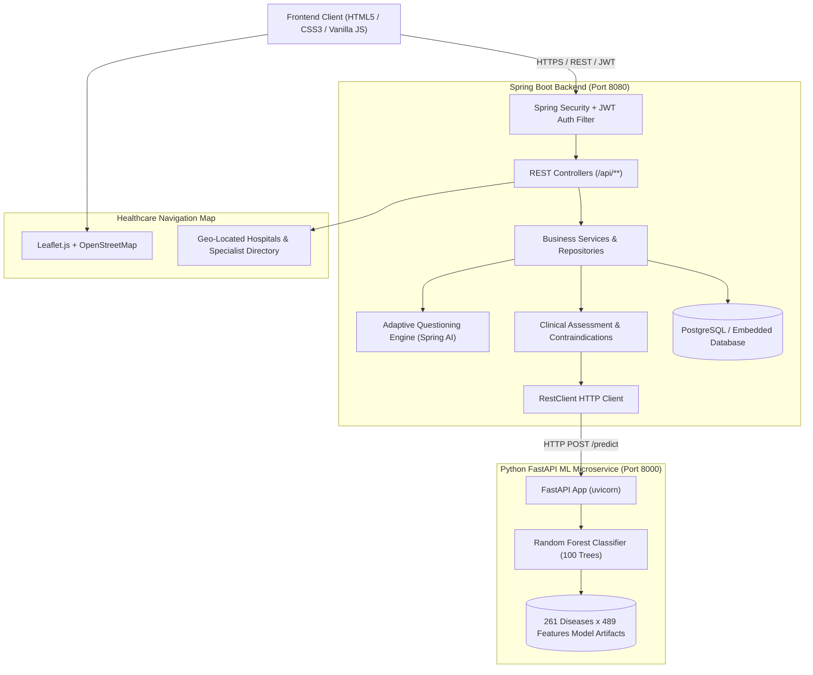

# Personalized AI Health Assistant for Disease Risk Assessment

An academic and clinical research-ready web application combining **Spring Boot 3**, **Spring AI**, a **Scikit-Learn Machine Learning microservice**, and a responsive **HTML5/CSS3/Vanilla JavaScript frontend** styled with Google Stitch's **Clinical Intelligence** design system.

The system delivers adaptive conversational symptom inquiry, preliminary disease-risk classification across **261 diseases and 489 clinical symptom features**, explainable differential diagnoses, patient medical history personalization, and interactive geo-located healthcare navigation.

> **IMPORTANT MEDICAL & ACADEMIC DISCLAIMER**  
> This software is engineered strictly for **preliminary health-risk assessment, educational research, and healthcare navigation guidance**. It does **NOT** constitute medical diagnosis, clinical treatment, or pharmaceutical prescription. Users must always seek the advice of certified physicians or emergency medical services for health concerns.

---

## Table of Contents
1. [Architectural Overview](#architectural-overview)
2. [Technology Stack](#technology-stack)
3. [Machine Learning Dataset & Model](#machine-learning-dataset--model)
4. [Project Structure](#project-structure)
5. [Core Functional Modules](#core-functional-modules)
6. [Complete REST API Reference](#complete-rest-api-reference)
7. [Setup & Execution Guide](#setup--execution-guide)
8. [Automated Verification & Unit Tests](#automated-verification--unit-tests)
9. [Academic Contribution & Safety Protocols](#academic-contribution--safety-protocols)

---

## Architectural Overview

The application adopts a decoupled microservice architecture:



### Architectural Highlights
* **Zero Framework Bloat on Frontend**: Built strictly with native **HTML5, modern CSS3, and Vanilla JavaScript (`fetch()`)**, eliminating multi-megabyte Node/React bundles and enabling instant browser rendering.
* **Dual-Mode Spring AI Integration**: Connects to external Large Language Models (OpenAI/Gemini) when an API key is configured, while seamlessly defaulting to an intelligent clinical heuristic and regex dictionary engine if offline.
* **Resilient ML Microservice Fallback**: If the Python inference microservice is temporarily stopped or unreachable, Spring Boot activates an internal heuristic assessment engine (`fallback: true`) rather than throwing an HTTP 500 error.
* **Unified Single-Port Deployment**: The frontend is maintained in `frontend/` and automatically mirrored to `backend/src/main/resources/static/`, allowing single-command serving on port 8080.

---

## Technology Stack

| Layer | Technologies & Frameworks |
| :--- | :--- |
| **Backend Core** | Java 17/22, Spring Boot 3.3.4, Spring Web, Spring Data JPA, Hibernate ORM |
| **Security** | Spring Security 6, Stateless JWT (JJWT 0.12.6, HMAC-SHA256), BCrypt Password Hashing |
| **Database** | PostgreSQL 18 with automatic embedded PostgreSQL-mode database fallback (`data/healthai_db`) |
| **AI Layer** | Spring AI, Adaptive Questioning Engine, Dual-Language Clinical Dictionary (English & Hindi) |
| **Machine Learning** | Python 3.11+, FastAPI 0.115, Scikit-Learn 1.5.2, Pandas 2.2.3, NumPy 2.1.1, Joblib 1.6.0 |
| **Frontend UI/UX** | Pure HTML5, CSS3, Vanilla JavaScript, Google Stitch "Clinical Intelligence" Design System |
| **Mapping & GIS** | Leaflet.js 1.9.4, OpenStreetMap Tiles, Haversine Great-Circle Distance Calculation |
| **Build & Tools** | Apache Maven 3.9+, Uvicorn 0.30+, JUnit 5, MockMvc |

---

## Machine Learning Dataset & Model

### Clinical Dataset Profile
* **Disease Classes**: 261 distinct conditions spanning:
  * Cardiovascular & Thoracic (Myocardial Infarction, Coronary Heart Disease, Pulmonary Embolism, Pericarditis)
  * Respiratory (Asthma, COPD, Pneumonia, Bronchitis, COVID-19, SARS)
  * Infectious Diseases (Dengue, Malaria, Anthrax, Cholera, Typhoid, Ebola, Tuberculosis)
  * Neurological & Psychiatric (Stroke, Migraine, Epilepsy, Parkinson's, Multiple Sclerosis)
  * Oncology (Lung Cancer, Lymphoma, Leukemia, Breast Carcinoma, Melanoma)
  * Dermatology, Orthopedics, Gastroenterology, Gynecology, ENT, and Pediatrics
* **Symptom Features**: 489 granular clinical binary features (e.g., `chest pain`, `cold sweat`, `shortness breath`, `barky cough`, `fever`, `hemoptysis`, `nuchal rigidity`).
* **Source Dataset**: Stored at `ml-service/data/diseases_symptoms.csv`.

### Classifier Architecture & Persistence
* **Algorithm**: `RandomForestClassifier(n_estimators=100, max_depth=25, random_state=42)`.
* **Artifacts Generated**:
  * `ml-service/models/model.joblib`: Serialized Scikit-Learn ensemble model.
  * `ml-service/models/symptoms_features.json`: Ordered list of 489 feature names.
  * `ml-service/models/disease_metadata.json`: Pre-computed symptom frequencies and medical specialties.
  * `ml-service/full_specialty_map.json`: Complete 261-disease to clinical navigation specialty mapping.

---

## Project Structure

```
minios/
├── README.md                                 # Complete project documentation
├── pom.xml                                   # Root Maven parent descriptor
├── backend/                                  # Spring Boot Core Application
│   ├── pom.xml                               # Backend build dependencies
│   └── src/
│       ├── main/
│       │   ├── java/com/healthai/
│       │   │   ├── HealthAiApplication.java  # Spring Boot Main Entrypoint
│       │   │   ├── ai/                       # Spring AI & Assistant Services
│       │   │   │   ├── AiAssistantService.java
│       │   │   │   ├── AiClient.java
│       │   │   │   ├── SpringAiClient.java
│       │   │   │   └── adaptive/             # Multi-Turn Adaptive Engine
│       │   │   │       ├── AdaptiveQuestioningEngine.java
│       │   │   │       ├── StructuredSymptomState.java
│       │   │   │       └── SymptomDictionary.java (100+ terms in EN & HI)
│       │   │   ├── controller/               # REST API Controllers
│       │   │   │   ├── AiController.java
│       │   │   │   ├── AssessmentController.java
│       │   │   │   ├── AuthController.java
│       │   │   │   ├── ChatController.java
│       │   │   │   ├── HealthcareController.java
│       │   │   │   ├── HealthController.java
│       │   │   │   ├── HistoryController.java
│       │   │   │   └── PredictionController.java
│       │   │   ├── entity/                   # JPA Database Entities
│       │   │   │   ├── User.java
│       │   │   │   ├── ChatSession.java
│       │   │   │   ├── ChatMessage.java
│       │   │   │   └── PatientHistory.java
│       │   │   ├── healthcare/               # Healthcare Facilities Service
│       │   │   │   ├── HealthcareFacilityDto.java
│       │   │   │   └── HealthcareService.java
│       │   │   ├── prediction/               # ML Microservice Client & Assessment
│       │   │   │   ├── AssessmentService.java
│       │   │   │   ├── MlPredictionClient.java (RestClient with fallback)
│       │   │   │   ├── PredictionService.java
│       │   │   │   └── dto/                  # Prediction Request/Response DTOs
│       │   │   ├── repository/               # Spring Data JPA Repositories
│       │   │   └── security/                 # Spring Security & JWT Configuration
│       │   └── resources/
│       │       ├── application.properties    # Backend Configuration
│       │       └── static/                   # Deployed Frontend Web Assets
│       └── test/                             # Automated MockMvc Test Suite
├── ml-service/                               # Python ML Prediction Microservice
│   ├── app.py                                # FastAPI Application Server
│   ├── train.py                              # Scikit-Learn Model Training Script
│   ├── test_api.py                           # Microservice Test Suite
│   ├── requirements.txt                      # Python Dependencies
│   ├── full_specialty_map.json               # 261-Disease Specialty Directory
│   ├── data/
│   │   └── diseases_symptoms.csv             # 261 Diseases x 489 Symptoms CSV
│   └── models/                               # Serialized ML Model Artifacts
└── frontend/                                 # Pure HTML5/CSS3/JS Web Application
    ├── index.html                            # Landing Page
    ├── login.html                            # Sign-In Interface
    ├── register.html                         # Patient Registration
    ├── dashboard.html                        # Patient Portal Dashboard
    ├── chat.html                             # Conversational AI Assistant
    ├── assessment.html                       # 3-Step Symptom Checker Wizard
    ├── result.html                           # Clinical Risk Assessment Report
    ├── history.html                          # Historical Health Timeline
    ├── profile.html                          # Patient Profile & Sensitivities
    ├── nearby-healthcare.html                # Leaflet Healthcare Map
    ├── css/
    │   └── style.css                         # Clinical Intelligence Design System
    └── js/
        ├── api.js                            # Centralized Vanilla JS API Client
        ├── chat.js                           # Multi-turn Chat & Voice Dictation
        ├── assessment.js                     # Assessment Wizard Logic
        └── history.js                        # Timeline & Modal Search Handling
```

---

## Core Functional Modules

### 1. Conversational AI & Adaptive Questioning
* Implements multi-turn clinical inquiry:
  $$\text{Symptom Extraction} \longrightarrow \text{Onset Duration} \longrightarrow \text{Severity (1-10)} \longrightarrow \text{Differential Inquiry} \longrightarrow \text{Triage}$$
* Supported Languages: **English** and **हिंदी (Hindi)**.
* Hands-free accessibility enabled via browser-native **HTML5 Web Speech API** (`webkitSpeechRecognition`).

### 2. Explainable Machine Learning Prediction
* Ingests patient symptoms, age, and gender.
* Matches terms via exact feature lookup and bidirectional substring expansion against the 489 clinical features.
* Computes probabilities for all 261 disease classes and returns the **Top-5 Explainable Differential Diagnoses** alongside matched symptom overlap and recommended clinical specialists.

### 3. Personalization & Contraindication Engine
* Integrates pre-existing conditions (Hypertension, Type 2 Diabetes, Asthma, Chronic Kidney Disease) and pharmaceutical allergies (Penicillin, Aspirin, NSAIDs, Sulfa).
* Evaluates cross-sensitivities and issues prominent contraindication warnings on clinical assessment reports.

### 4. Interactive Healthcare Navigation Map
* Powered by **Leaflet.js** and **OpenStreetMap**.
* Computes great-circle distances via the **Haversine formula**:
  $$d = 2r \arcsin\left(\sqrt{\sin^2\left(\frac{\Delta\phi}{2}\right) + \cos(\phi_1)\cos(\phi_2)\sin^2\left(\frac{\Delta\lambda}{2}\right)}\right)$$
* Automatically filters facilities by specialist recommendation (e.g. `Cardiologist`, `Pulmonologist`) and distance radius (5 km to 50 km).

---

## Complete REST API Reference

### Authentication Endpoints (`/api/auth`)
* `POST /api/auth/register` — Creates a new patient account with demographic data.
* `POST /api/auth/login` — Authenticates credentials and returns stateless JWT token.
* `GET /api/auth/me` — Returns profile details for the authenticated user (`Authorization: Bearer <token>`).

### AI Assistant & Chat Endpoints (`/api/chat` & `/api/ai`)
* `POST /api/chat/sessions` — Creates a new chat session (`language`, `title`).
* `GET /api/chat/sessions` — Lists previous consultation sessions for authenticated user.
* `POST /api/ai/chat` — Sends multi-turn message to the AI assistant; returns adaptive clinical response.
* `GET /api/ai/sessions/{id}/state` — Returns structured clinical state (symptoms, duration, severity, stage).

### Prediction & Clinical Assessment Endpoints (`/api/prediction` & `/api/assessment`)
* `POST /api/prediction/predict` — Invokes the Random Forest ML classifier for symptom list.
* `GET /api/prediction/status` — Checks operational health of Python ML microservice.
* `GET /api/prediction/specialties` — Lists unique medical specialties available across 261 diseases.
* `POST /api/assessment/evaluate` — Synthesizes symptoms, duration, severity, chronic conditions, and allergies into an explainable risk assessment report; automatically persists to `patient_histories` when authenticated.

### Health Timeline Endpoints (`/api/history`)
* `GET /api/history` — Lists historical assessments for the authenticated user in reverse chronological order.
* `GET /api/history/{id}` — Retrieves full clinical notes for a specific assessment.
* `POST /api/history/{id}/searched` — Increments the review/search counter (`searchesCount`).

### Healthcare Navigation Endpoints (`/api/healthcare`)
* `GET /api/healthcare/facilities` — Returns geo-located hospitals and clinics (`lat`, `lng`, `specialty`, `radiusKm`, `emergencyOnly`, `query`).
* `GET /api/healthcare/specialties` — Lists distinct healthcare specialties in the provider directory.
* `GET /api/healthcare/facilities/{id}` — Retrieves specific facility contact details.

---

## Setup & Execution Guide

### Prerequisites
* **Java**: JDK 17 or higher (Java 22 verified)
* **Maven**: Apache Maven 3.9+
* **Python**: Python 3.11+
* **Modern Web Browser**: Chrome, Edge, Firefox, or Safari

### Step 1: Start the Python ML Prediction Microservice
```powershell
cd ml-service
python -m pip install -r requirements.txt
python train.py
uvicorn app:app --host 127.0.0.1 --port 8000
```
*Health Check*: Navigate to `http://localhost:8000/health` (should return `status: "UP"`, `total_classes: 261`).

### Step 2: Start the Spring Boot Backend & Web Server
In a separate terminal:
```powershell
cd backend
mvn clean compile
mvn spring-boot:run
```
*Backend Health Check*: Navigate to `http://localhost:8080/api/health` (should return `status: "UP"`).

### Step 3: Access the Web Application
Open your browser and navigate to:
```
http://localhost:8080/
```
* **Landing Page**: `http://localhost:8080/index.html`
* **Sign In**: `http://localhost:8080/login.html` (Demo login available)
* **Dashboard**: `http://localhost:8080/dashboard.html`
* **AI Health Assistant**: `http://localhost:8080/chat.html`
* **Symptom Assessment**: `http://localhost:8080/assessment.html`
* **Nearby Care Map**: `http://localhost:8080/nearby-healthcare.html`

---

## Automated Verification & Unit Tests

Run the complete automated integration test suite with Maven:
```powershell
cd backend
mvn test
```

### Verified Test Suites:
1. `HealthControllerTest`: Health endpoint verification.
2. `AuthControllerTest`: User registration, password encryption, JWT issuance.
3. `ChatAndHistoryControllerTest`: User-isolated chat sessions and patient history persistence.
4. `AiControllerTest`: Heuristic clinical AI responses and red-flag emergency detection.
5. `AdaptiveChatbotTest`: Multi-turn adaptive symptom questioning across English and Hindi.
6. `PredictionControllerTest`: Live ML prediction, explainability extraction, and offline fallback resilience.
7. `HealthcareControllerTest`: Haversine geo-distance calculation, radius filtering, and emergency facilities lookup.

---

## Academic Contribution & Safety Protocols

1. **Safety First (Non-Diagnostic)**: Every screen, response, and API payload embeds explicit medical disclaimers.
2. **Emergency Red-Flag Escalation**: Immediate detection of life-threatening symptom patterns (acute chest pain, respiratory arrest, unconsciousness) overrides standard flows with prominent `112 / 911` emergency buttons.
3. **Data Integrity & Privacy**: Patient history records are strictly scoped to the authenticated user ID.
4. **Resilience**: The backend remains fully operable even if external LLMs or internal ML microservices experience downtime.

---

*Authored for Academic Research & Demonstration in Artificial Intelligence in Healthcare.*
